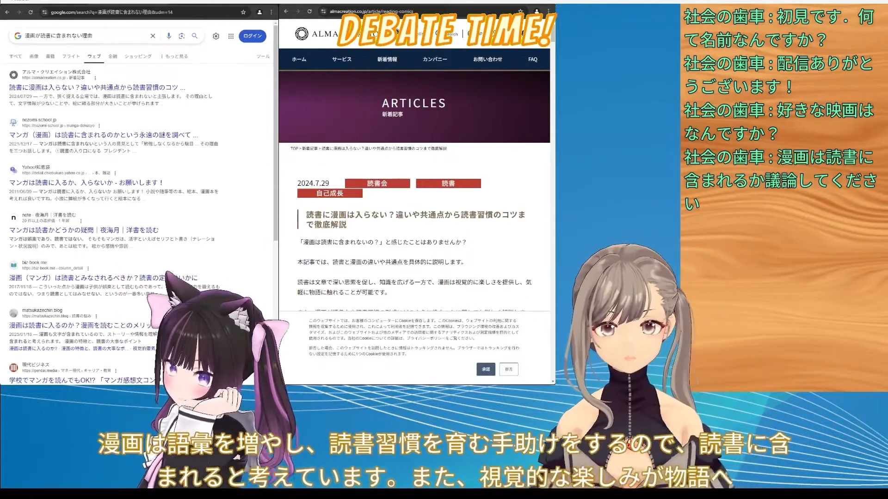
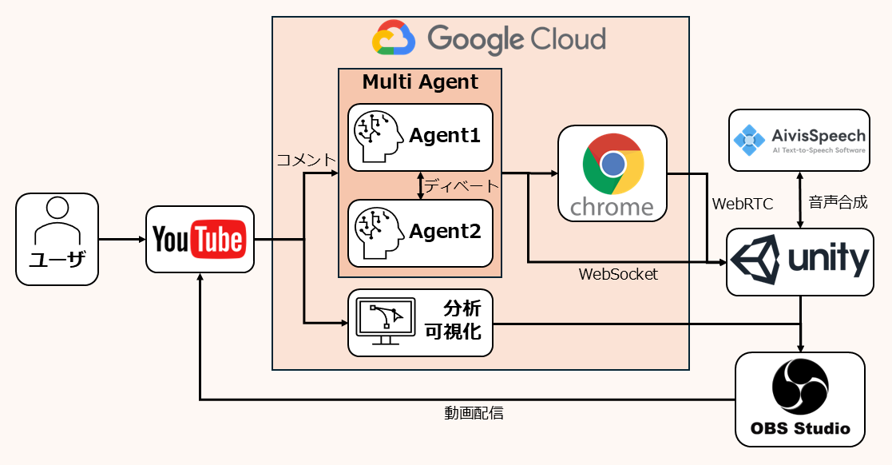
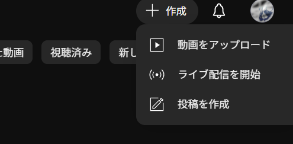

# AI Vtuber: AIエージェントによるYoutube配信システム

本プロジェクトでは，Chromeを使い，情報収集をしながらディベートするマルチエージェントAI Vtuberシステムを作成しました．\
２人のAIエージェントがYoutube上で，視聴者を交えてインタラクティブなライブ配信を行います．AIエージェントは必要に応じてbrowser-useやReasoningモデル等をツールとして使用するため，正確性の高いレスポンスが得られます．\
また，両者に相反する主張を与えてディベート形式で議論を行わせる機能も備えており，批判的な観点からエージェントのアウトプットを検証できます．\
さらに，エージェントにはシステムプロンプトで任意の性格を付与できるため，必要に応じて論理性を重視した展開にすることも，エンターテインメント性を高め，ライブ配信を楽しめるような展開にすることも可能です．

## アーキテクチャ


## エージェントシステム
- Talk Model\
RAGでキャラ設定や会話履歴を与えられる．\
通常の返答に加えて，感情や行動を出力する．
- Assist Model\
Talk Modelの出力の行動がNothingではなかった場合に呼び出される．\
browser-useとThinking Modelをツールとして与えられたエージェントとなっており，Talk Modelが指定した行動に応じて，文脈を読んでタスクを実行する．
- BrowserUse\
Assist Modelの指示によりWebブラウジングをして，その結果を報告する
- Thinking Model\
Assist Modelの指示により，より深い思考を行い，その結果を報告する

## GCEセットアップ
GCEで16GB以上のVARM容量を持つインスタンスを作成してください．
適切なGPU Driverとcuda toolkitをインストールしてください．下記の環境で動作を確認しています．\
Debian GNU/Linux 12 (bookworm) \
Driver Version: 560.35.03 \
Cuda compilation tools, release 12.4, V12.4.131

仮想ディスプレイのセットアップを行います.
```
# 仮想ディスプレイの依存パッケージをインストール（Ubuntu/Debian の場合）
sudo apt update
sudo apt install xvfb git fonts-dejavu xdotool -y
curl -LsSf https://astral.sh/uv/install.sh | sh
```

chromeのインストールを行います.
```
wget https://dl.google.com/linux/direct/google-chrome-stable_current_amd64.deb
sudo apt install ./google-chrome-stable_current_amd64.deb
```

WebRTC通信とWebSocket通信用に，GCEのファイアーウォールポリシーを編集し，8443と5000ポートを開放する必要があります．

また，通信のために静的な外部IPを指定する必要があります．
GCEにアクセスして，以下のコマンドを実行してください．
- リポジトリのダウンロード(git がインストールされていない場合は先にgitをインストールしてください)
```
git clone https://github.com/ONIXION/ai_youtuber.git -b feature-gce-hosting
cd ai_youtuber
```
- Python環境の構築(uv がインストールされていない場合は先にuvをインストールしてください)
```
uv sync
uv pip install torch torchvision torchaudio --index-url https://download.pytorch.org/whl/cu126
```
- 環境変数の準備

`.env`ファイルを作成し，ルート（`ai_youtuber/`）に配置し，中に環境変数を書き込んでください．
```
OPENAI_API_KEY='sk-xxxxxxxxxxxxxxxxxxxxxxxxx'
GOOGLE_API_KEY='xxxxxxxxxxxxxxxxxxxxxxxxxxxxxxxxxxx'
```
- client_secrets.json

[こちらのサイト](https://qiita.com/Tomonobu3110/items/24c4e256498e1c4de922)を参考にしてYouTubeDataAPIv3を使えるようにしてください．\
途中で認証情報をダウンロードする所があるので，そこでダウンロードしたjsonファイルの名前を`client_secrets.json`へと変更してルート(`ai_youtuber/client_secrets.json`)に配置します．

## ローカルセットアップ
ここからはローカルでの作業になります．
- AivisSpeechのインストール\
[こちら](https://aivis-project.com/#products-aivisspeech)からダウンロードしてインストールしてください．
- 棒読みちゃんのインストール\
[こちら](https://chi.usamimi.info/Program/Application/BouyomiChan/)からダウンロードしてインストールしてください．
- OBS Studioをインストール\
[こちら](https://obsproject.com/ja/download)からOBS Studioをインストールしてください.\
配信を行うには，OBSとYoutubeを連携させておく必要があります．
- Unityのセットアップ\
Unityバージョンは2022.3.42f1を使ってください．\
[Google Drive](https://drive.google.com/file/d/1kYpy6Mn_qmk-PAYPDmrpDwBwla7euOW0/view?usp=sharing)から.zipファイルをダウンロードしてください．\
.zipファイルを解凍すると，Unityのプロジェクトフォルダになります．\
Unity Hubの`Add project from disk`から，そのプロジェクトフォルダを指定し，プロジェクトをUnity Hubに追加してください．\
プロジェクトを開いたら，ヒエラルキーウィンドウから`Empty`オブジェクトを選択し，インスペクターウィンドウで`Web Socket Client (スクリプト)`>`Server Url`の`localhost`の部分を，GCEで指定した外部IPに変更してください．\
また，ヒエラルキーウィンドウから`BehindCanvas`>`WebRTCImage`を選択し，インスペクターウィンドウで`Web RTC Client`>`Server Url`の`34.133.108.164`の部分を，GCEで指定した外部IPに変更してください．\
Unity HubからAItuberプロジェクトを開いて，Unityエディタの`ファイル`->`ビルド設定`->`ビルド`からアプリをビルドし，`AItuber.exe`を作成してください.

## 動かし方
- main.pyを実行する
GCEで以下のコマンドを実行します．
```
xbfv uv run -m src.main
```
- AivisSpeechとBouyomiChanを起動する
- AItuver.exeを実行する
main.pyの出力でUnityを起動するように指示されるので、そのタイミングでUnityを起動してください．\
Unity側で画面の受信を確認できてからキー入力をして先に進むようにしてください。
- Youtubeで配信を開始する\
配信したことがない場合，配信できるようになるまで１日かかります\
YouTubeホーム画面右上の`+作成`から`ライブ配信を開始`を選択してください．



- OBSでウィンドウの設定をする\
AItuver.exeの画面を`ウィンドウキャプチャ`>`AItuber`>`キャプチャ方法：Windows10`でキャプチャします．
- OBSの配信開始ボタンを押す
- Youtubeの配信画面から動画のURLを取得して，ポップアップウィンドウに入力する\
このURLはYoutubeStudioに表示されるものではなく，Youtubeの一般の配信画面のURLである必要があります．

## ファイル構造
```
ai_youtuber/
├── main.py               # メインスクリプト（配信システムのエントリーポイント）
├── youtube.py           # YouTube API関連の処理
├── connect_unity.py     # Unity連携用スクリプト（WebSocket実装）
├── requirements.txt     # Pythonパッケージの依存関係
│
├── AItuber/            # Unityプロジェクト
│   ├── Assets/
│   │   ├── Scripts/    # Unityスクリプト（C#）
│   │   │   ├── AivisSpeech.cs      # 音声合成
│   │   │   ├── AutoBlink.cs        # 瞬き制御
│   │   │   ├── DisplayComment.cs   # コメント表示
│   │   │   ├── WebSocketClient.cs  # WebSocket通信
│   │   │   └── ...
│   │   └── ...         # その他アセット（モデル、アニメーション等）
│   │
│   ├── Packages/       # Unityパッケージ
│   └── ProjectSettings/# Unityプロジェクト設定
│
├── image_data/         # ReadMe用の画像データ保存ディレクトリ
│   └── ...
│
├── text_data/          # テキストデータ保存ディレクトリ
│   ├── memory.txt      # 会話履歴
│   └── setting.txt     # 設定ファイル
│
└── chroma-db-*/        # ChromaDBのデータベースファイル
```
